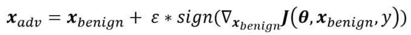

# Adversarial Attack on Multimodal Fusion Systems

## Experiment plan 1 Baseline Attack-FGSM

### 1. Description

Simply modify the inputs based on backpropagation using FGSM in the trained model. The FGSM attacking method is given by the following formula

Where $\epsilon$ is the step size for the gradient ascent.

### 2. Realization Plan

- After the model has been trained for enough epochs, we backpropagate the gradient to the input data in all modalities.  
- Then we add FGSM purturbation to each sample and find the attack results. We try diffent $\epsilon$ settings and observe how the results change.  
- The final results will show here.
- Open a new branch named attack to do so

